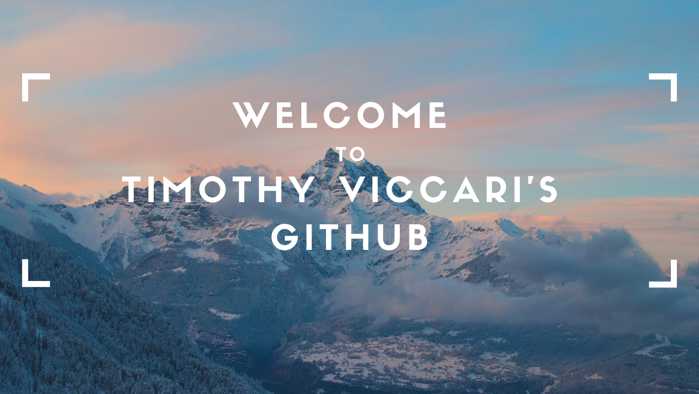

   </img>

 

&nbsp;&nbsp;

<h2 align="center">Welcome to my GitHub! </h2>

---------------------
### **Technologies and Tools**

   - **Languages** : Python, JavaScript(ES6), SQL, CSS, HTML, Markdown
   - **Frameworks/Layouts/Templates** : Django, Tailwinds CSS, React, Next.js, Bootstrap
   - **Libraries/Tools** : Whitenoise, JSON Web Tokens, Docker, Beautiful Soup, Jupyter, seaborn, matplotlib, scikit-learn, NumPy, Pandas, Pip, Poetry, Heroku, Git, DevTools, Regex, npm, Node.js, Chart.js

---------------------

---------------------

<!--
**everydaytimmy/everydaytimmy** is a ✨ _special_ ✨ repository because its `README.md` (this file) appears on your GitHub profile.

Here are some ideas to get you started:

- 🔭 I’m currently working on ...
- 🌱 I’m currently learning ...
- 👯 I’m looking to collaborate on ...
- 🤔 I’m looking for help with ...
- 💬 Ask me about ...
- 📫 How to reach me: ...
- 😄 Pronouns: ...
- ⚡ Fun fact: ...
-->
